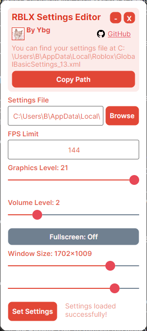

# Roblox Settings Editor

## Description

**THIS WAS ONLY TESTED ON WINDOWS 11**

A _WINDOWS ONLY_ app I made for editing certain Roblox settings OUTSIDE of Roblox, and enforcing those settings.

This is especially useful for games like Rogue Lineage, where most people use a lot of alt accounts.
For example, say you want to run a 23/23 full server with one main account that runs at 60fps.
Normally, you'd have to go into the Roblox settings file and manually change the FPS to 1 for the alt accounts or join on an alt and set the graphics to 1 and leave then rejoin on all the others to make sure the graphics setting will apply to the other instances.

That's fine and dandy but it gets annoying when you leave on your main account and on a alternate account.
What happens is the settings file gets overridden by your main account (60 fps, full screen, full volume, etc.) but re-overridden by your alt account (1 fps, small screen, no volume, etc.)
And when you try to join back on another main account, it'll inherit those settings from the low-performance alt account.

What this program does is enforces the settings YOU WANT, not what you last put into Roblox.
If Roblox tries to change any settings in the xml file, this will override any changes to variables that you yourself set. **[CURRENTLY THE OVERRIDE SETTINGS FEATURE IS BROKEN]**

## Installation

Just install the .zip, extract, and throw the .exe into your desktop folder and hit run. Everything is contained within the .exe.

## How to Build

dotnet publish "./Roblox Settings Editor.csproj" -c Release -r win-x64 --self-contained true -p:PublishSingleFile=true -p:IncludeNativeLibrariesForSelfExtract=true
